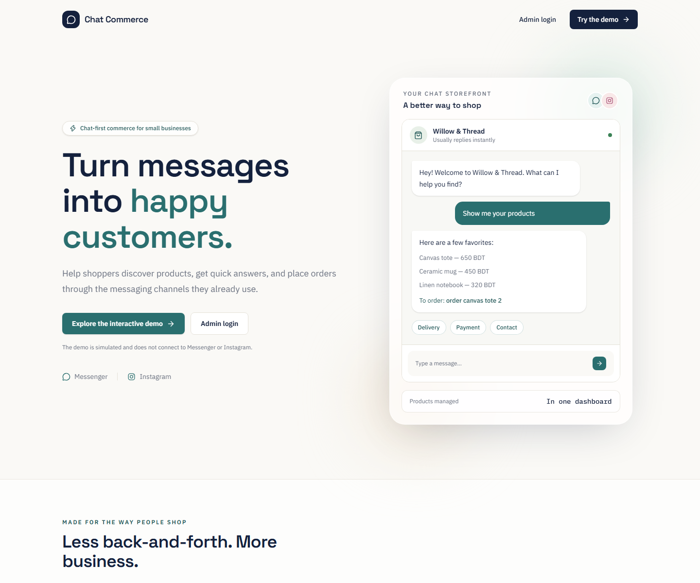
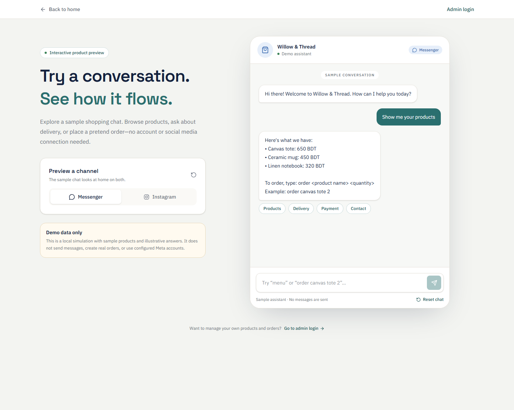

# Chat Commerce

Chat Commerce helps small businesses manage their product catalog and orders while automating customer conversations on Meta messaging channels.

## Try the public demo

The dashboard homepage introduces the app. Select **Try the demo** to explore a simulated chat without signing in:

- Browse sample products with `menu` or the **Products** quick reply.
- Ask about delivery, payment, contact, order tracking, or returns.
- Try a sample order such as `order canvas tote 2`.
- Switch between Messenger and Instagram previews or reset the conversation.

The demo is a frontend-only simulation. It does not send messages through Meta, access a business account, or create real orders. The sample shop, products, and answers are illustrative.

## Screenshots

| Public landing page | Interactive chatbot demo |
| --- | --- |
|  |  |

## Run locally

Requirements: Node.js and npm.

```bash
npm install
npm run dev
```

Open [http://localhost:3000](http://localhost:3000), then visit `/demo` to try the chat or `/login` to open the admin sign-in page.

The public landing page and chatbot demo work without the backend. Admin features require the backend API, a configured MongoDB database, and the environment variables described in the backend setup. The dashboard uses `NEXT_PUBLIC_API_URL` for the API origin and defaults to `http://localhost:5000`.

## Dashboard features

- Manage products in the catalog.
- Review and update incoming orders.
- Configure chatbot settings.
- Register or sign in to a business dashboard.

## Tech stack

- Next.js App Router, React, and TypeScript
- Tailwind CSS
- Express, MongoDB, and Mongoose backend
- Messenger and Instagram webhook adapters
- Separate order and information reply services
